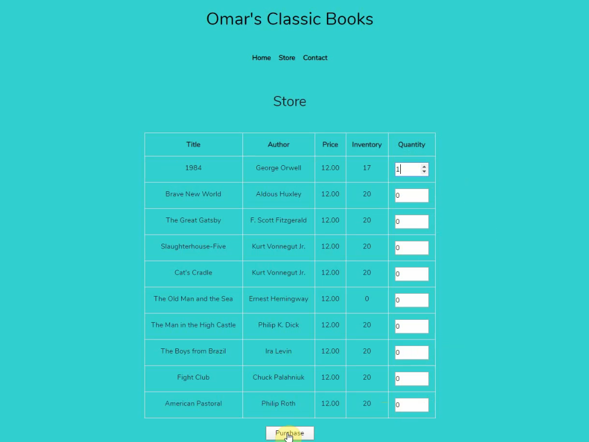

<h1>Omar’s Classic Books E-Commerce Website</h1>

This web application is for a fictional bookstore in Hoboken, New Jersey. It was created as part of a project for a college course. Through the website, books can be selected for purchase and a delivery date can be set for when the books will be received by the customer.

This website was developed with JavaScript, Vue.js, PHP, Laravel and MySQL.

<em>Disclaimer: This web application is for example/educational purposes only and shouldn't be used for an actual E-commerce website.</em>

<h3>Home Page</h3>

<h3>Store Page</h3>

<h3>Payment Page</h3>

<h3>Delivery Page</h3>

<h3>Confirmation Page</h3>

<h3>Order Complete Page</h3>

